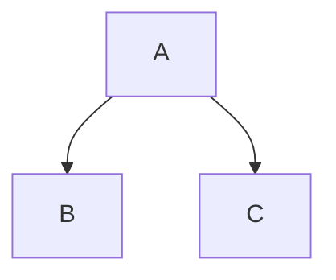

Learning Git and Github!
=
Subheadline
-
Version **control** is an essential skill for _developers_ to master, and ~~Git~~ is by far the most popular version control system on the web. In this fast-paced course, author Ray Villalobos `shows` you how to install Git and use the fundamental commands you need to work with Git projects: moving files, managing logs, and working with branches.

| left | center |   right |
| -    | :-:    |   -:    |
| 1    |  2     |    3    |

<details>
<summary>collapsed</summary>
                    
# Header

this is the copy for the collapsed text.
</details>

🤬



This is a footnote[^1]. Another footnote[^2].

[^1]: My reference
[^2]: Another footnote

```js
let x = 5;
console.log(x);
```

***
* Item one
* Item two

1. Item One
2. Item two
   - Indented
   - Another one

> Plus, you'll [learn](https://www.linkedin.com) how to work with the popular GitHub website to explore existing projects, clone them to your local hard drive, and use them as templates for your new projects.
https://www.linkedin.com/

[comment]: <> ([Tomolor]: https://pixelprowess.com/i/stargazers/tomolor.png)
[commnet]: <> (![Tomolor]https://pixelprowess.com/i/stargazers/tomolor.png)
[//]: # "[](https://rayboo.org) this is a image with link"
